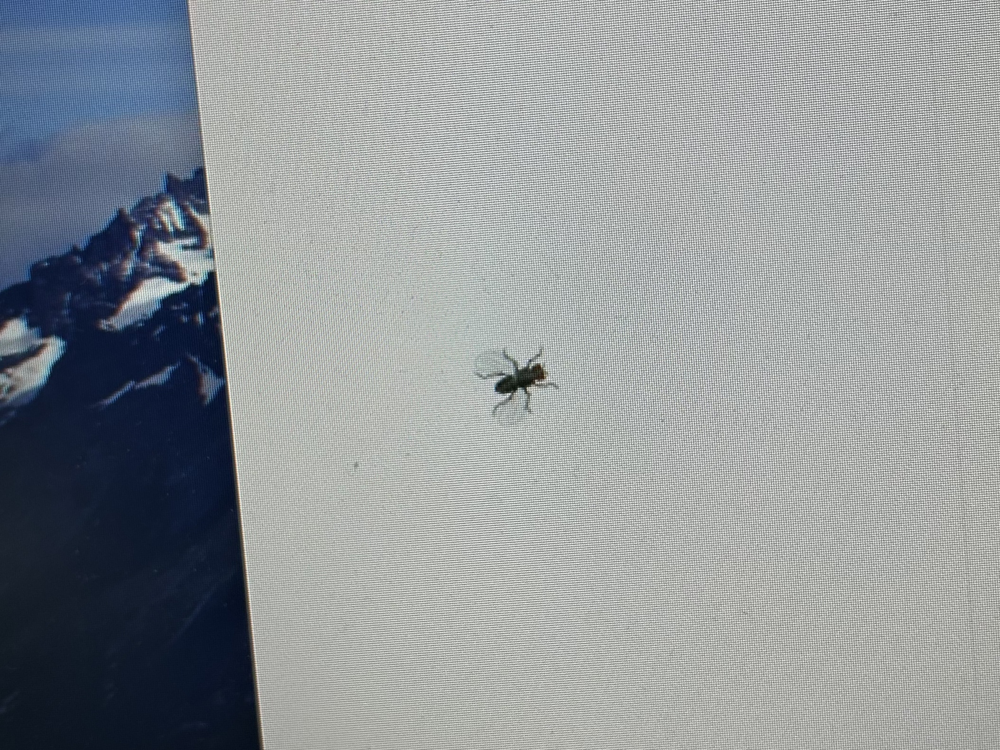
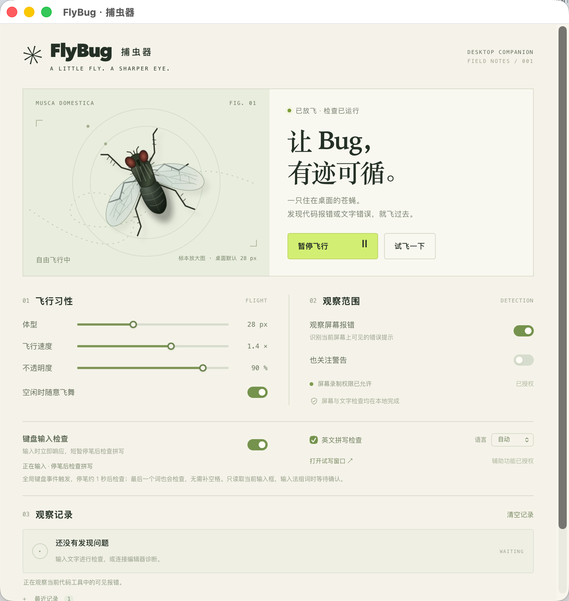

# FlyBug

FlyBug 是一个只在本机运行的 macOS 小工具：桌面上有一只约 28 px 的苍蝇，发现输入框中的英文拼写/简单语法问题或收到真实代码诊断时，飞到对应位置。苍蝇窗口透明且不抢鼠标焦点。所有常驻能力都在一个 `FlyBug.app` 进程中，接入脚本只是向它的本机 HTTP bridge 发请求。

要求：macOS 14 或更高版本、Apple Silicon 随附构建、Python 3（仅安装接入脚本需要）。不需要网络、账号、API key 或第三方运行库。

## 效果预览

<p align="center">
  
  <br>
  <sub>桌面实拍：约 28 px 的苍蝇停在屏幕上，透明窗口不抢鼠标焦点。</sub>
</p>

<p align="center">
  
  <br>
  <sub>控制面板：调整体型、飞行速度、不透明度，开启键盘输入检查与屏幕报错观察。</sub>
</p>

## 启动

双击 `FlyBug.app`，或双击 `启动 FlyBug.command`。控制面板可以重新打开、暂停、调整苍蝇大小/速度/透明度、开启文字检查和屏幕诊断。菜单栏中的 FlyBug 菜单可以重新打开面板或退出。

初次使用请在系统设置的“隐私与安全性”中允许 FlyBug 的“辅助功能”；要识别屏幕上的终端或编辑器报错，还要允许“屏幕与系统音频录制”（旧版 macOS 叫“屏幕录制”）。授权后退出并重新打开 FlyBug。权限由用户在系统设置中授予，程序不会修改隐私设置。

## 输入框检查

“文字语法检查”通过 macOS Accessibility 读取当前获得焦点的可编辑控件，停笔约 1 秒后在本机检查。它支持普通文本框、textarea、终端命令行以及部分 Chromium/Electron 控件；不会读取密码框，也不会扫描整页网页或上传输入内容。富文本控件只能得到控件级位置时，苍蝇会停在输入框附近。

英文由系统拼写/语法检查器处理；中文只覆盖少量明确的“的/地/得”和重复字规则，不能替代完整语法或语义审校。应用不保证发现所有错误。点击控制面板的“打开试写窗口”可检查本机检查器是否正常，但跨应用输入仍需要辅助功能授权及目标应用提供可访问文本。

微信 4.1 的聊天输入区只暴露窗口级 AX 节点，因此 FlyBug 对微信采用受限兼容路径：仅在真实键盘/鼠标输入后识别窗口底部的消息编辑条，不读取上方聊天记录；若窗口未在前台、未开启屏幕录制或输入条不在底部，面板会显示暂不可读。其他应用仍遵守 AXValue/光标范围检查。普通输入框可以用 `tests/external-inputs.html` 做基准测试。

## 代码诊断接入

### Codex 与 Claude Code

双击 `接入 Codex 和 Claude Code.command`，或在项目目录运行：

```sh
python3 integrations/install.py --apply --tool all
```

安装器会把 `flybug-report` 技能安装到 `~/.codex/skills` / `~/.claude/skills`，并把 Claude Code 失败 hook 合并到现有设置（修改前备份）。安装后重启工具或新开会话。技能上报的是工具已经确认的文件、行号和错误；它不会自行判断所有逻辑问题。

### VS Code、Cursor、Windsurf

先启动 FlyBug，再在编辑器扩展面板选择“从 VSIX 安装”，打开 `extension/flybug-companion-0.1.0.vsix`。扩展每 5 秒发送当前编辑器可见的真实诊断；状态栏显示 FlyBug 表示 bridge 已连接。已在本机 VS Code 1.137.0 安装并确认真实 bridge 上报；定位优先匹配屏幕中的错误行文字，匹配不到时才使用保守的窗口级回退。它支持错误和可选警告，也提供“Report Selection as Logic Issue”手动上报已确认的逻辑问题。语言服务必须先产生诊断，扩展不会扫描整个项目或推理代码。

### 终端与其他工具

双击 `启动系统终端捕虫.command` 只启动 FlyBug，不会创建第二个常驻 shell/PTY。随后在系统 Terminal、Codex CLI、Claude Code 或编辑器集成终端中照常工作；前台窗口的可见报错由屏幕观察识别。对于非交互命令，推荐使用：

```sh
python3 bridge/flybug.py run -- python3 -m unittest
python3 bridge/flybug.py run -- npm test
```

明确上报文件和行号：

```sh
python3 bridge/flybug.py report --file /absolute/path/app.py --line 12 \
  --message '空数组输入会触发越界'
python3 bridge/flybug.py status
python3 bridge/flybug.py clear
```

`run` 保留原命令输出和退出码，并从常见 Python/JS/TS/Rust 错误中提取位置；`report` 适用于任何编辑器、检查器或 AI 工具。`pty` 是可选的交互包装入口，不是日常启动方式：`python3 bridge/flybug.py pty --source terminal -- zsh`。

## Bridge 安全边界

FlyBug 在 `127.0.0.1` 的随机端口监听，发现文件位于 `~/Library/Application Support/FlyBug/bridge.json`，权限为 0600。请求必须携带当前 Bearer token，跨站 Origin 被拒绝。bridge 只接受本机工具提供的诊断，不保存输入文本、不上传网络。收到诊断后，只有在能确认前台窗口和坐标时才移动苍蝇；没有可靠位置时只在面板记录，不会假装定位。

## 测试与构建

在已安装 Xcode Command Line Tools 且存在有效 Apple Development 签名的 Mac 上：

```sh
./build.sh
./FlyBug.app/Contents/MacOS/FlyBug --self-test
python3 -m unittest discover -s tests -p 'test_*.py' -v
node extension/test_extension.js
codesign --verify --deep --strict FlyBug.app
```

外部输入观察脚本只读取 FlyBug 的状态，不代替用户输入：

```sh
python3 tests/observe_external.py --expect found --app "Google Chrome" --timeout 30
```

切回浏览器输入错误文字并停笔；`--expect clear` 检查修正后清除，`--expect protected` 检查密码框跳过。脚本不能自动操作 Codex、微信等应用。

## 目录

- `FlyBug.app`：唯一常驻桌面应用。
- `Sources/`、`Resources/`、`Info.plist`、`build.sh`：原生源码和构建文件。
- `bridge/`：Python 标准库 CLI 与 bridge 说明。
- `integrations/`：Codex/Claude 安装器、hook 与 `flybug-report` skill。
- `extension/`：VS Code 系扩展源码和随附 VSIX。
- `tests/`：回归、自检及外部输入观察脚本。
- `docs/screenshots/`：README 中使用的效果预览截图。

项目不包含云端服务或后台守护进程。删除交付文件夹即可移除应用；若曾安装接入，再删除相应的本地 skill、Claude hook 和 `~/.local/share/FlyBug`。

## 许可证

本项目采用 [MIT 许可证](LICENSE) 开源。你可以自由使用、修改、分发，包括商用，只需保留版权声明与许可声明。软件按“原样”提供，不附带任何担保。

`extension/` 中的 VS Code 系列扩展同样采用 MIT 许可证（见 `extension/LICENSE`）。
